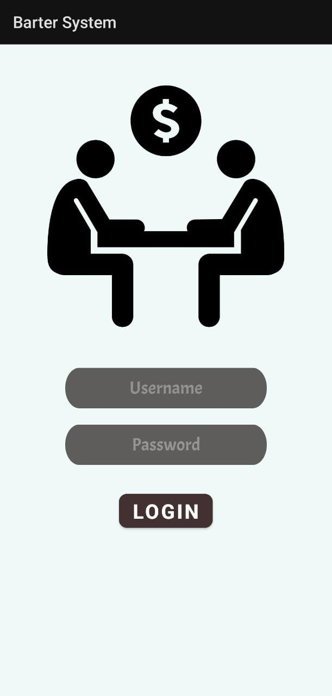
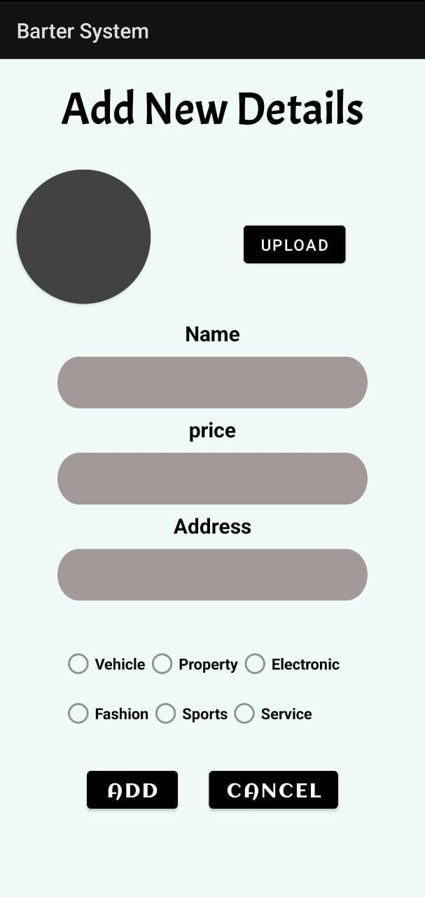
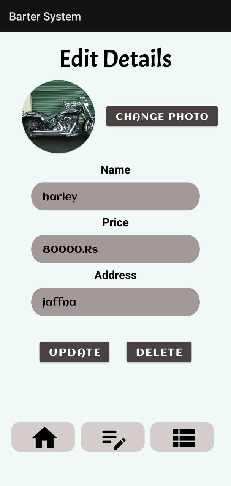
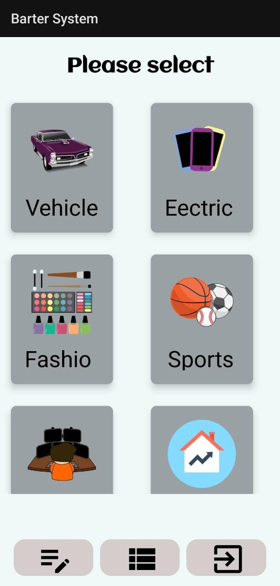
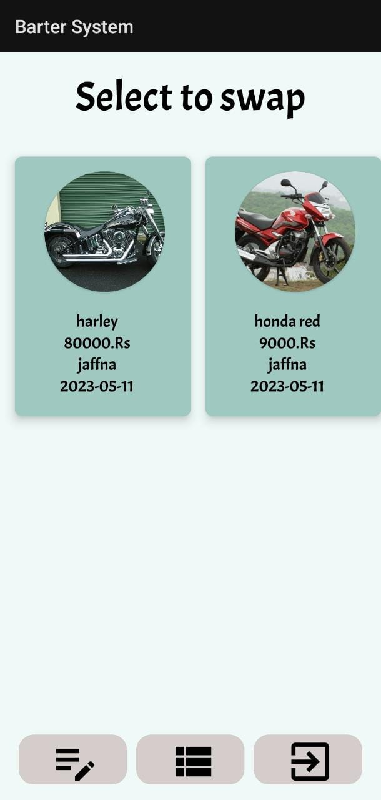
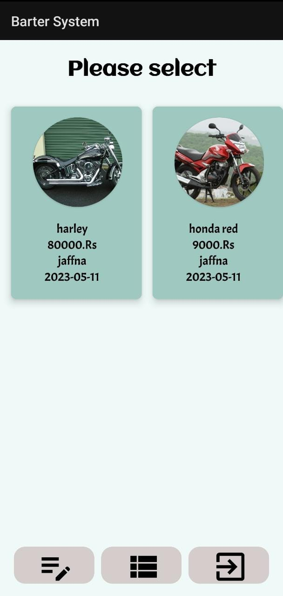
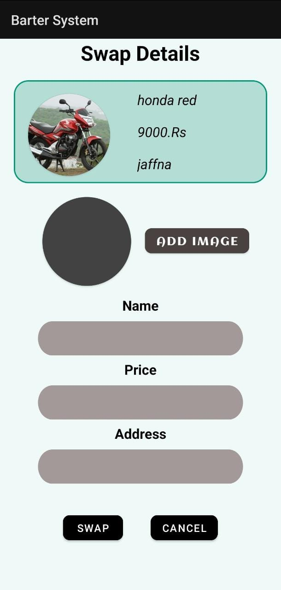
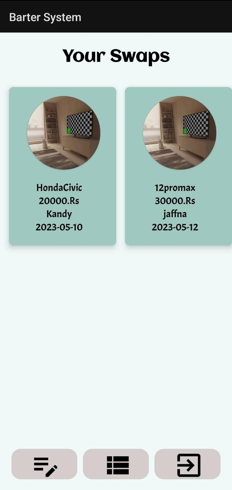

<h1 align="center">Swapping App 🤝</h1>

## IMPORTANT
This code is only for width < 600dp and 480dp ≤ height < 900dp

Do you buy a new phone when you get a scratch on it??. Well even if you do, I won't. There are many people like me who cannot buy new things as a replacement after getting small damage to their old things. And also there are people who can't buy new things for a bigger price but small things for an average price. Yes, we exist. And this sample app shows how we can swap our accessories with the accessories of others. As this is a sample app, there is only one user(Buyer/Swapper) and one admin(Seller).     

Functions that can be done,

- Admin -> Add new items, Edit details of items 
- User -> Add accessories to swap, Edit details of those accessories. 

Used software/ technologies,

- Firebase realtime database
- Firebase storage
- Native Android Development - Android Studio (Kotlin)

Screenshots (Admin side):

                                                                           
Screenshots (User side):

## Author

👤 **Abinayan Ratnasingam**

- Github: https://github.com/AbinayanRatna
- LinkedIn: https://www.linkedin.com/in/abinayan-ratnasingam-5092b3214/

## Show your support

Give a ⭐️ if this project helped you!
